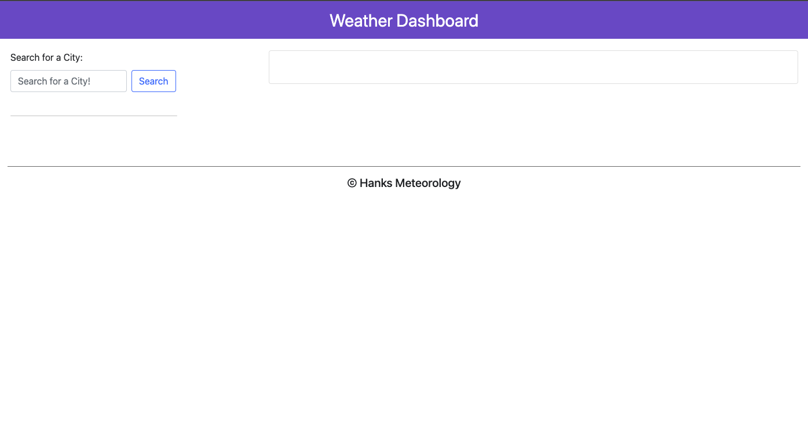
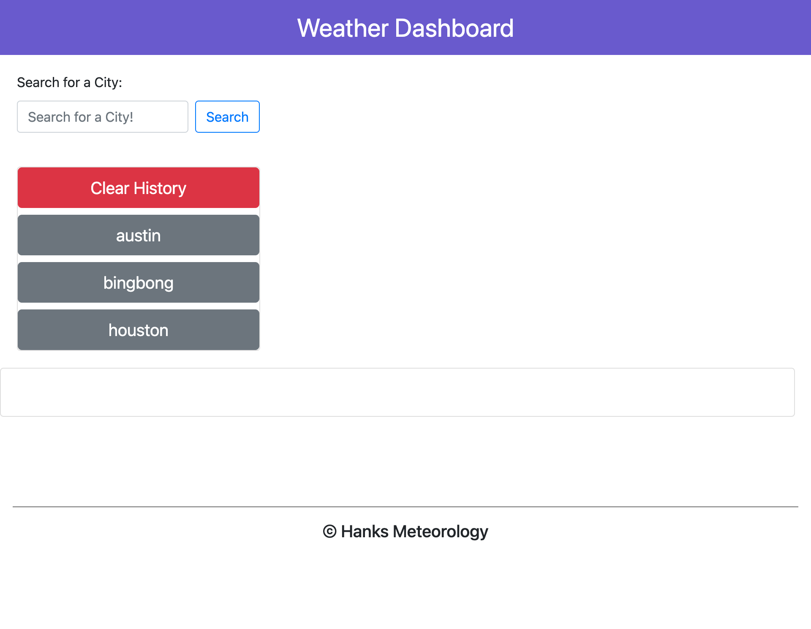
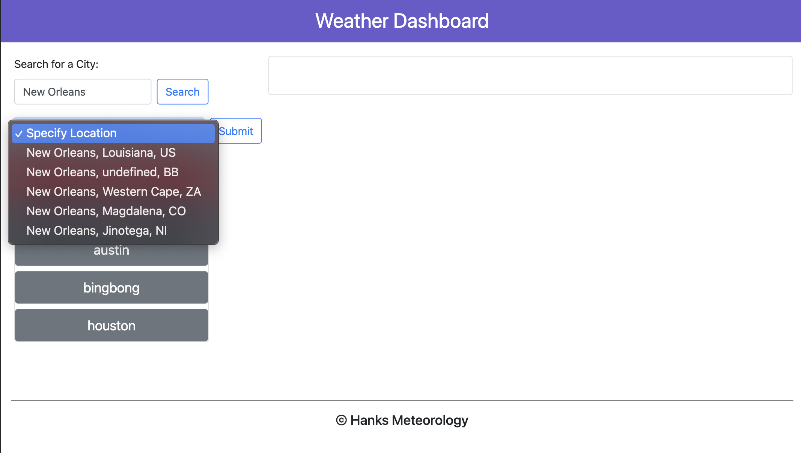
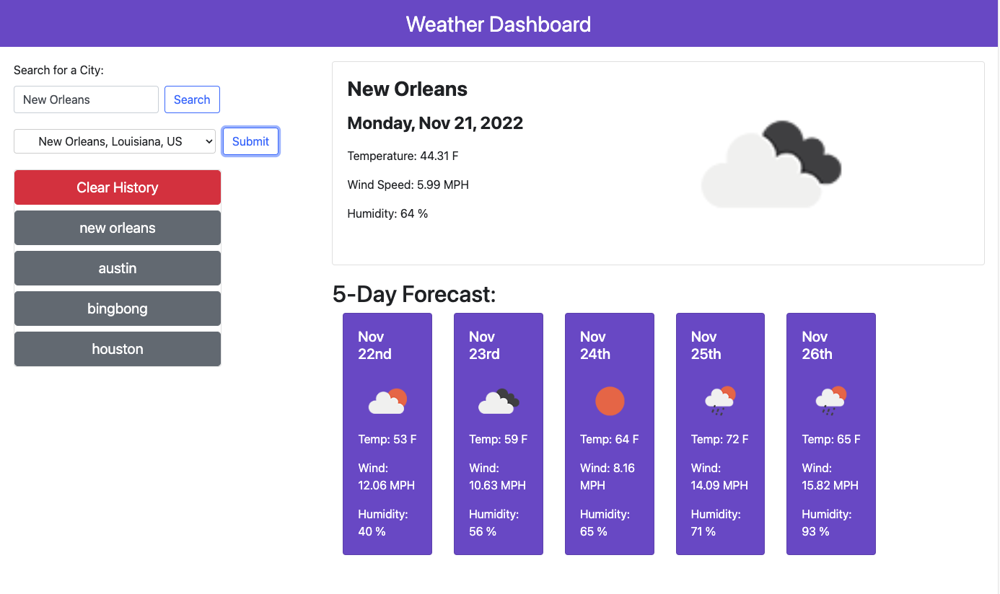
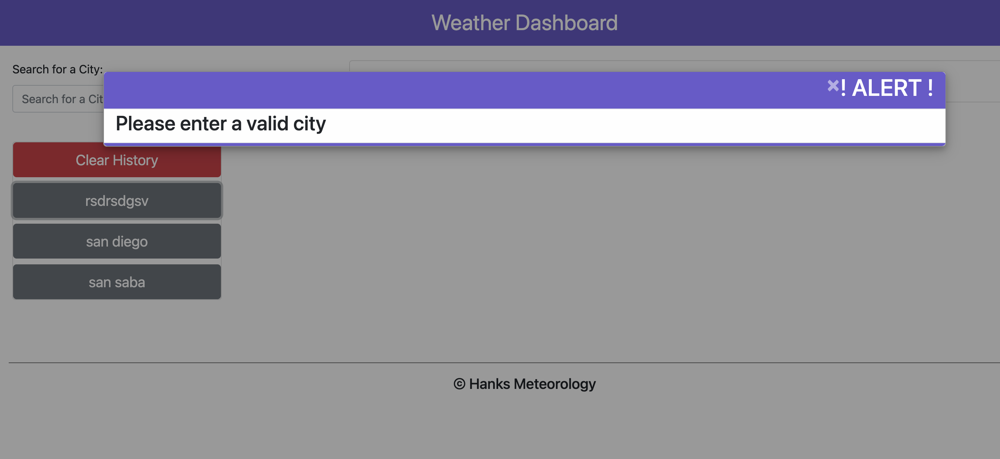

# wk6 - Weather Dashboard

# Description
The purpose of this project is to utilize server-side APIs to create a weather dashoard. This dashboard allows the user to select a city to display weather information, narrow down the search to a specific location for multiple city results, save previous searches, and clear previous searches.

When the user enters a valid text input (cannot be blank), one of three events occur:
1) The city does not exist, therefore no data is displayed, but the invalid search is listed in storage to show the user that the input was accepted.
2) The city selected has only one location in the world; weather data is automatically displayed
3) The city selected has multiple locations and a dropdown menu + submit button are generated for the user to further narrow down the search. On a valid submit, the weather for the specified search is displayed.

## Installation

N/A

## Usage

Open the webpage using the [live URL link](https://chloeeh.github.io/hanks-weather-dashboard/) and use Chrome Developer Tools to inspect the source code. The code is commented and includes accessibility tags compared to the original code that used generic division tags.

## Credits

Resources used:
1) Bootcamp Pre-work Modules
2) [One Call API (weather API) + internal links](https://openweathermap.org/api/one-call-3)
3) [Format .dayjs()](https://day.js.org/docs/en/display/format) 
4) [Geocoding API + internal links](https://openweathermap.org/api/geocoding-api)
5) [jQuery Get Selected Option From Dropdown](https://stackoverflow.com/questions/10659097/jquery-get-selected-option-from-dropdown)
6) [How to return value from addEventListener](https://stackoverflow.com/questions/33501696/how-to-return-value-from-addeventlistener)
7) [Remove and element ONLY if it exists](https://forum.jquery.com/topic/jquery-remove-an-element-only-if-exists)

## License

Please refer to the LICENSE in the repository.